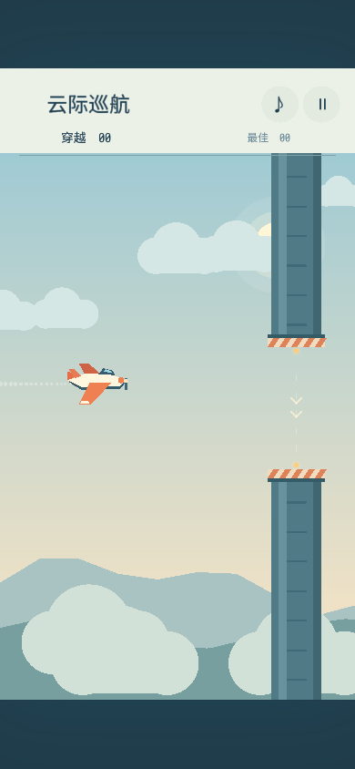

# Cloud Cruise / 云际巡航

An inertial flight game built with Dora SSR. Drag to change the plane's altitude; releasing gradually stabilizes the plane without gravity pulling it down. Fly through moving gates whose openings alternate between high and low bands. Each gate has its own oscillation phase and frequency.



## Run

Import this folder into the Dora SSR Web IDE and run `init.lua`. The Lua sources run directly and use the engine's bundled `sarasa-mono-sc-regular` font. The plane, scenery, and gates are drawn with `DrawNode`; synthesized sound effects are included in `Audio/`. No external packages are needed to play. Tested with Dora SSR 1.9.2.

## Controls

- Mobile: drag vertically in the play area; release to stabilize at the new altitude.
- Desktop: drag with the mouse, or use Up/Down or W/S.
- Space/Return: start, pause, or continue. P/Esc: pause or continue. R: restart. M: toggle sound.
- Sound and pause buttons are also available in the upper-right corner.

The scene uses a 640-unit logical height, with a wider flight view on landscape screens. Each cleared gate scores one point; hitting a gate ends the run. Best scores are saved as `cloud-cruise-best.txt` in `Content.writablePath`.

## Difficulty and simulation

Over the first 30 points, forward speed increases from 165 to 225 units/second, openings narrow from 124 to 92 units, and gate movement amplitude increases from 60 to 84 units. Difficulty then remains capped. Gate centers are spaced 320 units apart. Each new gate receives a separate phase and frequency, with a transfer-height check between consecutive moving openings.

The simulation uses a fixed 1/120-second step. Vertical speed and acceleration are capped, and pausing freezes both flight and gate movement.

## Source and tests

- `FlightModel.lua`: inertial altitude control, gate generation, motion, difficulty, collision, and scoring.
- `FlightArt.lua`: procedural plane, clouds, mountains, and gates.
- `init.lua`: Dora scene, responsive layout, input, audio, and persistence.
- `Tests.lua`: altitude holding, controls, collision, scoring, pause, resize, motion limits, independent gate movement, and seeded route simulations.

With Dora SSR running and the CLI connected:

```sh
dora cli run -p "path/to/Cloud Cruise" --entry init.lua
dora cli run -p "path/to/Cloud Cruise" --entry Tests.lua
```

The suite prints `FLIGHT_TESTS_PASS` on success. It includes 128 seeded simulations reaching 60 points with an automated steering controller; these checks do not guarantee that every random route is equally easy for a human player. To regenerate the included icon and synthesized audio, install Pillow and run `python tools/make-assets.py`; this is optional for playing the demo.

## 中文说明

将整个文件夹导入 Dora SSR 的 Web IDE，运行 `init.lua`。飞机自动前进，上下拖动调整高度，松手后逐渐稳定；电脑也可使用上下方向键或 W/S。每穿过一道障碍得一分，碰撞后结束，支持暂停、重开和最高分存档。

手机竖屏与电脑横屏采用适配布局。管道独立上下运动，相邻管道交替分布在高低区域；速度、开口大小和运动幅度在前 30 分逐渐变化，随后保持难度上限。运行 `Tests.lua` 可执行规则和随机航道模拟测试。

## License

MIT, as specified in the repository's [LICENSE](../LICENSE). The artwork is procedural and the included sound effects are synthesized by `tools/make-assets.py`.
