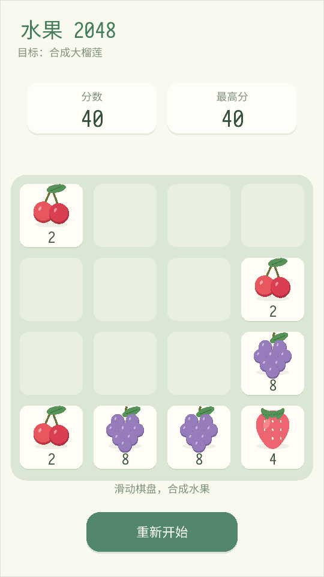

# Fruit 2048 / 水果 2048

A portrait-friendly 2048 puzzle built with Dora SSR. Merge matching fruit tiles on a 4×4 board, starting with cherries and working toward the 2048 durian. The cream-and-green interface, rounded cards, and eleven fruit illustrations are drawn with engine primitives.



## Run

Import this folder into the Dora SSR Web IDE and run `init.lua`. The checked-in Lua files run directly; the TypeScript files are the editable sources. `Game/FreshArt.lua` is a handwritten drawing module with a matching TypeScript declaration.

The demo uses Dora SSR's built-in `sarasa-mono-sc-regular` font and Lua support library. No external image assets, browser controls, or package installation are required. Tested with Dora SSR 1.9.2.

## Controls

- Swipe or drag on the board to move the tiles.
- Arrow keys or WASD also move the tiles.
- Tap **重新开始** or press **R** to restart.
- After game over, tap the board or press Space/Return to restart.

The best score is saved as `fruit2048_best.txt` in `Content.writablePath`. A `*` after the best score indicates that it could not be saved to disk.

## Source and tests

`Game/FruitBoard.ts` contains the merge rules; `BoardView.ts`, `FreshArt.lua`, `Hud.ts`, and `Effects.ts` render the scene. `FruitGame.ts` coordinates input, animations, scoring, and persistence. `PreviewFruits.lua` displays the fruit progression.

After editing TypeScript, rebuild it in the Web IDE. With the engine running and its Web IDE connected, the CLI can also build and run the project:

```sh
dora cli build -p "path/to/Fruit 2048" --lang ts
dora cli run -p "path/to/Fruit 2048" --entry init.lua
dora cli run -p "path/to/Fruit 2048" --entry Tests.lua
```

`Tests.lua` runs the board, save, and scene suites and prints `FRUIT_2048_TESTS_PASSED` on success. The save and scene suites use separate test files and remove them when finished.

## 中文说明

将整个文件夹导入 Dora SSR 的 Web IDE，运行 `init.lua` 即可。游戏采用奶油白与柔和绿色界面，包含 11 级程序化水果插画、合成动画、最高分存档，以及按屏幕尺寸缩放的布局。

在棋盘上滑动或拖动，也可用方向键／WASD 移动；点击“重新开始”或按 R 重开。按钮、提示与触摸输入均由 Dora 场景实现。修改 TypeScript 后通过 Web IDE 编译；运行 `Tests.lua` 可执行逻辑、存档和场景测试。

## License

MIT, as specified in the repository's [LICENSE](../LICENSE).
