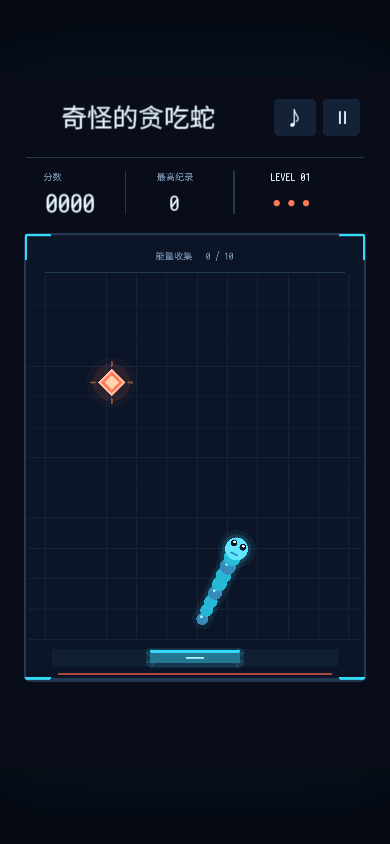

# Strange Snake / 奇怪的贪吃蛇

A snake-and-breakout arcade game built with Dora SSR. Move the paddle to bounce the snake's head toward a single randomly placed energy snack. Eating grows the snake; every ten snacks completes a level. Paddle contact position controls the rebound angle, and speed increases up to a fixed cap.



## Run

Import this folder into the Dora SSR Web IDE and run `init.lua`. The Lua sources run directly and use the engine's bundled `sarasa-mono-sc-regular` font. The scene is drawn with `DrawNode`; synthesized sound effects are included in `Audio/`. No external packages are needed to play. Tested with Dora SSR 1.9.2.

## Controls

- Desktop: move the mouse, or use Left/Right or A/D, to move the paddle.
- Mobile: drag horizontally to move the paddle. The 360×640 scene scales to fit portrait and landscape screens.
- Space/Return: start, launch, pause, or continue. P/Esc: pause. R: restart. M: toggle sound.
- After losing a life, tap the field or press Space to launch again.

You have three lives. The snake does not collide with itself. New food avoids the snake and the previous food location. Consecutive snacks between paddle bounces increase the score multiplier. Best scores are saved as `snake-neon-save.txt` in `Content.writablePath`.

## Source and tests

- `SnakeModel.lua`: pure Lua rules, fixed 1/120-second simulation, collisions, single-food generation, scoring, and body-path sampling.
- `SnackArt.lua`: procedural snake, food, and interface drawing helpers.
- `init.lua`: Dora scene, input, effects, audio, and persistence.
- `Tests.lua`: food placement, bounces, paddle aiming, life loss, level changes, pause, frame-rate independence, and speed limits.

With Dora SSR running and the CLI connected:

```sh
dora cli run -p "path/to/Strange Snake" --entry init.lua
dora cli run -p "path/to/Strange Snake" --entry Tests.lua
```

The rule suite prints `SNAKE_TESTS_PASS` on success. To regenerate the included icon and synthesized audio, install Pillow and run `python tools/make-assets.py`; this is optional for playing the demo.

## 中文说明

将整个文件夹导入 Dora SSR 的 Web IDE，运行 `init.lua`。移动底部挡板反弹蛇头，吃掉场上唯一的能量食物；吃掉后随机生成下一个，累计十个进入下一关。共有三条生命，逐关提速并设有上限，蛇身无自碰撞。

电脑使用鼠标、左右方向键或 A/D；手机左右拖动。画面按屏幕等比缩放。空格开始、发射、暂停或继续，R 重开，M 切换音效。运行 `Tests.lua` 可执行规则测试。

## License

MIT, as specified in the repository's [LICENSE](../LICENSE). The artwork is procedural and the included sound effects are synthesized by `tools/make-assets.py`.
